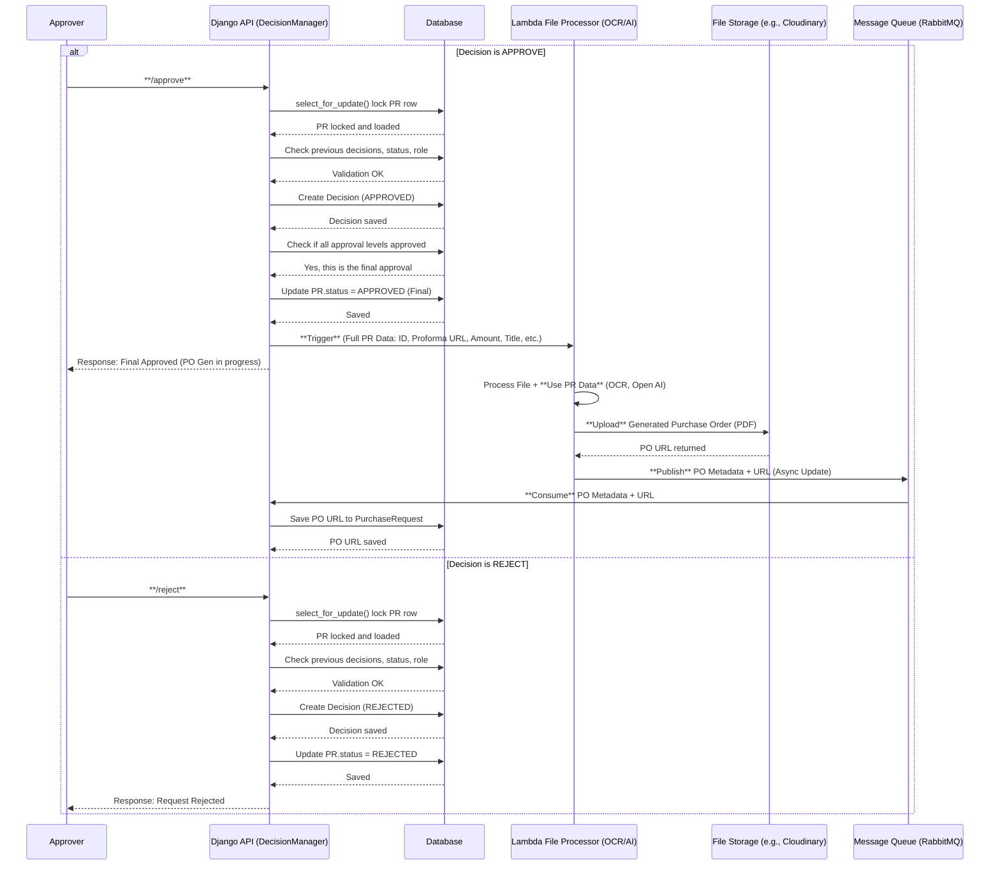

# 💸 Purchase Request Decision Flow (Async PO Generation)

This flow handles approver decisions (Approve/Reject) while offloading heavy Purchase Order (PO) generation to a serverless Lambda function, ensuring the Django API remains fast and responsive by performing the PO creation asynchronously.

## Components

- **A:** Approver (user)
- **API:** Django API (`DecisionManager`)
- **DB:** Stores PRs, Decisions, status
- **LFS:** Lambda File Processor (OCR + OpenAI PO generation)
- **ST:** File Storage (e.g., Cloudinary)
- **MQ:** Message Queue (e.g., RabbitMQ)

## Flow

### 1\. Decision Submission (`/approve` or `/reject`)

1.  **A** submits decision to **API**.
2.  **API** locks PR row (`select_for_update()`), validates request, and creates **Decision** in **DB**.

### 2\. Outcome

#### REJECT

- PR.status → `REJECTED`
- Lock released; API returns `Request Rejected`.

#### APPROVE

- If final approval: PR.status → `APPROVED (Final)`
- Trigger **LFS** with **Full PR Data** (including ID, Amount, Description, and Proforma URL).
- Lock released; API returns `Final Approved (PO Gen in progress)`.

### 3\. Asynchronous PO Generation (Updated)

1.  **LFS** uses the **PR Data** and the **Proforma file** to process and generate the final PO (OCR + OpenAI).
2.  Uploads PO to **ST**, obtains **PO URL**.
3.  Publishes **PO URL** to **MQ**.
4.  **API** consumes message and updates **DB** with PO URL.

## Sequence Diagram (Updated)

