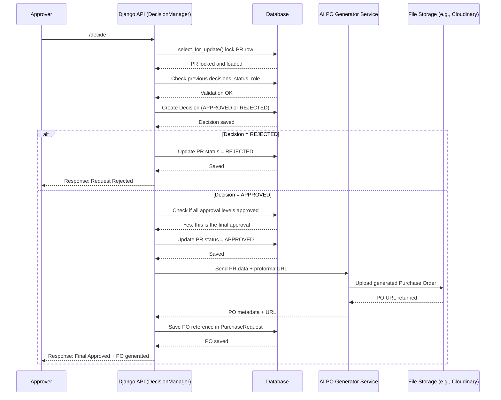

## Approval Decision + AI Purchase Order Generation Flow

The sequence diagram below illustrates what happens internally when an approver makes a decision (approve or reject) on a purchase request.  
It includes:

- Row-level locking using `select_for_update()`
- Sequential multi-level approval checks
- Decision creation
- Status updates (approved/rejected)
- Triggering an AI service to generate a Purchase Order (PO)
- Uploading the generated PO to a storage provider (e.g., Cloudinary)
- Saving the PO URL back to the database

