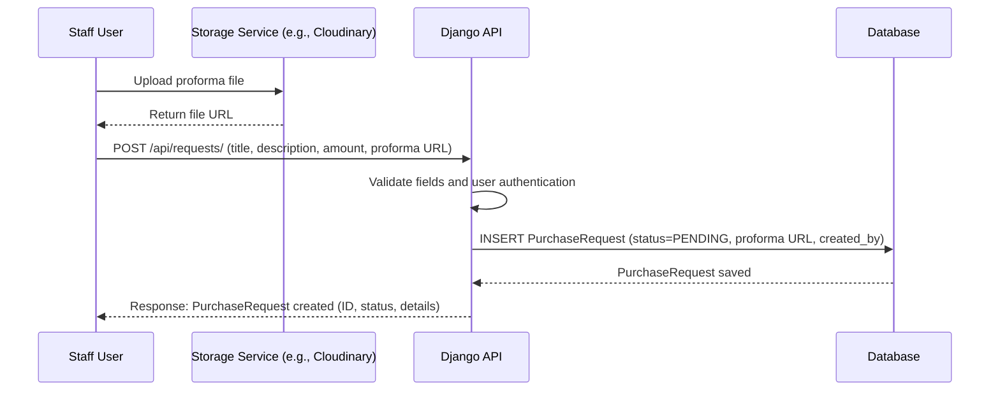

# Purchase Request Creation Flow

This sequence diagram shows the process when a `staff` user creates a new purchase request. The user first uploads a proforma document to a storage service (e.g., Cloudinary), then submits the purchase request to the Django API, which saves the request in the database.

