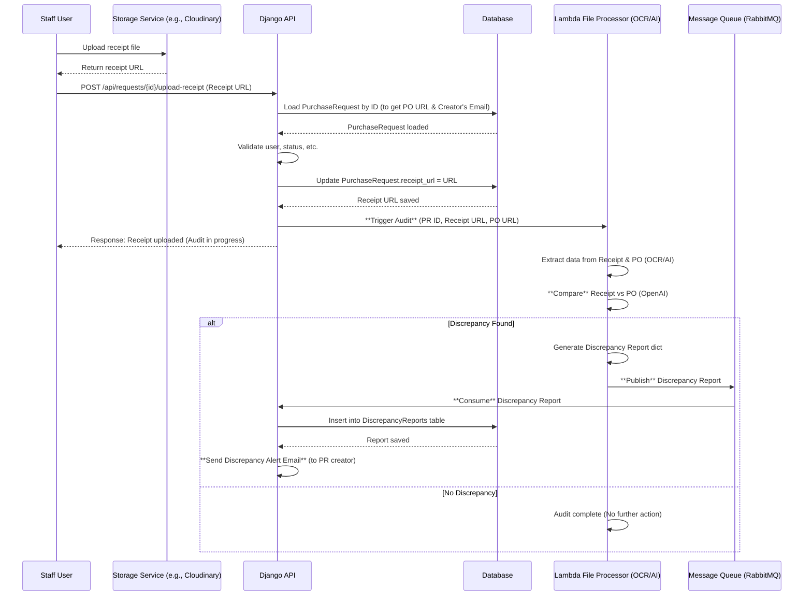

# 🧾 Receipt Upload Flow (Asynchronous Audit with Direct Notification)

This flow details the asynchronous process triggered when a **Staff User** uploads a product receipt.

1.  The user first uploads the receipt file to the **Storage Service (ST)** and sends the resulting URL to the **Django API**.
2.  The **API** validates the request, saves the `receipt_url` in the database, and immediately responds to the user.
3.  The **API** then asynchronously triggers the **Lambda File Processor (LFS)**, providing the Receipt URL, the corresponding **Purchase Order (PO) URL**, and the PR data.
4.  The **LFS** uses **OCR/AI** to compare the contents of the Receipt against the PO.
5.  If a mismatch is detected, the **LFS** publishes a `Discrepancy Report` to the **Message Queue (MQ)**.
6.  The **API** consumes this message, saves the report to the `DiscrepancyReports` table in the **DB**, and directly sends an **email notification** to the Purchase Request creator.

## Sequence Diagram

