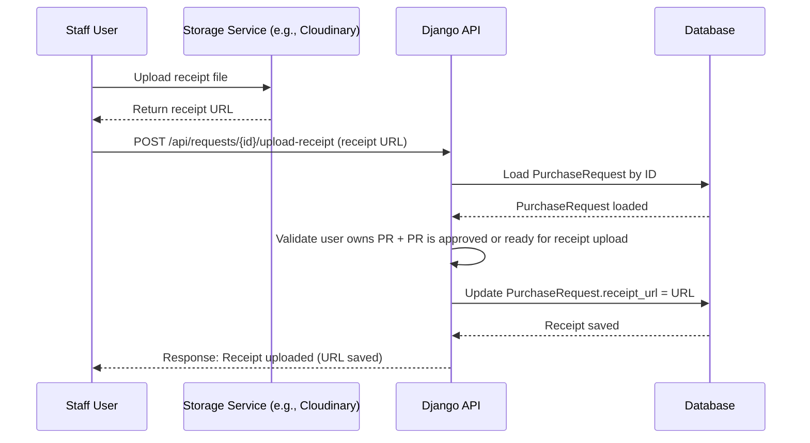

# Receipt Upload Flow (URL Update Only)

This sequence diagram describes the process when the staff user uploads the receipt for an approved purchase request.  
The front-end first uploads the file to the storage provider (Cloudinary or similar), then submits the file URL to the Django API.  
The API simply updates the `receipt` field of the PurchaseRequest.

