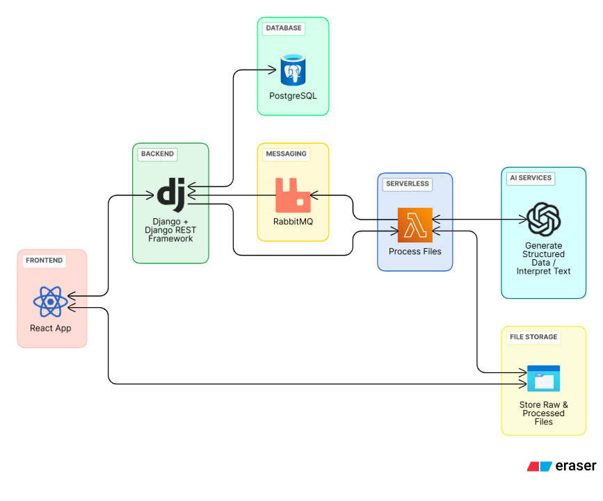

# System Architecture – High-Level Overview

## Architecture Diagram

## Overview

The Procure-to-Pay system is a **RESTful API architecture** using **Django REST Framework** with a **React frontend**, supporting file processing and AI-driven data interpretation.

## Components

- **Frontend (React App)**: Submits purchase requests and uploads/downloads files.
- **Backend (Django + DRF)**: Handles API endpoints, authentication, and orchestrates business logic.
- **Messaging (RabbitMQ)**: Queues asynchronous file processing tasks.
- **Serverless (PO Processor Lambda)**: Extracts text from uploaded files and generates processed outputs (PDFs).
- **AI Services (OpenAI API)**: Interprets extracted text and generates structured data.
- **Database (PostgreSQL)**: Stores users, purchase requests, and approval data.
- **File Storage (Object Storage)**: Holds raw uploads and processed files.

## Data Flow (High-Level)

1. Client uploads a file / submits request → Django API.
2. Django queues processing task via RabbitMQ.
3. Lambda processes file → extracts text → sends to AI.
4. AI generates structured data → Lambda creates processed output (PDF).
5. Processed files stored in Object Storage → available to frontend.

## Technology Stack

- **Frontend**: React
- **Backend**: Django 5.2.8 + DRF 3.16.1
- **Serverless**: AWS Lambda
- **Messaging**: RabbitMQ
- **Database**: PostgreSQL
- **AI**: OpenAI API
- **Storage**: Azure Object Storage
- **Authentication**: JWT (djangorestframework-simplejwt)
