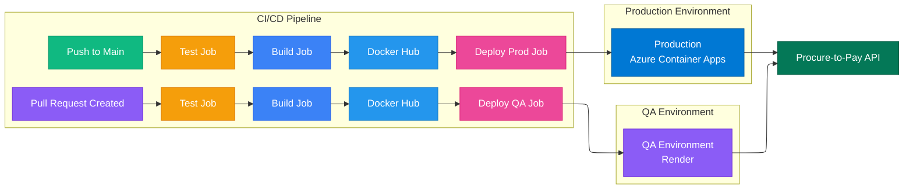

# Procure-to-Pay CI/CD Deployment

This document summarizes the CI/CD workflow for the Procure-to-Pay system.

## Overview

- **Pull Request Flow (QA)**

  - Triggered on PR creation.
  - Test job runs unit tests.
  - Build job creates Docker image.
  - Image pushed to Docker Hub.
  - QA deployment triggers Render environment.

- **Main Branch Flow (Production)**

  - Triggered on merge to main.
  - Test job verifies code.
  - Build job creates Docker image.
  - Image pushed to Docker Hub.
  - Production deployment triggers Azure Container Apps.

- **Backend API**

  - Procure-to-Pay API is accessed by both QA and production environments.
  - Handles staff, approver, and finance user requests.

- **Color Coding**

  - PR Event: Purple
  - Merge Event: Green
  - Test Job: Orange
  - Build Job: Blue
  - Docker Hub: Light Blue
  - Deploy Job: Pink
  - QA Env: Purple
  - Production Env: Blue
  - Procure-to-Pay API: Green
